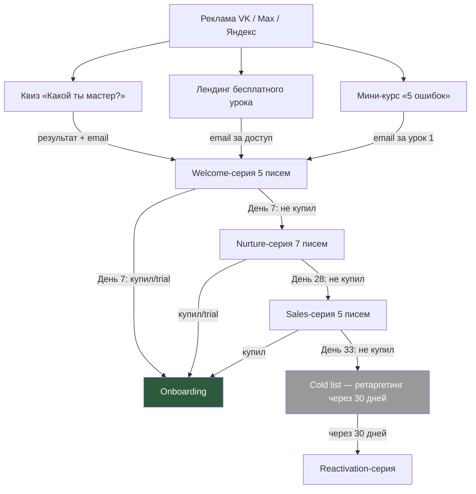

# Воронка 1: Холодный трафик

## Цель
Привлечь новых потенциальных учениц, которые не знают Катю Баскову, и провести их до пробного доступа или покупки.

## Схема

## Пошаговое описание

### Шаг 1: Рекламный креатив
**Площадки:** VK Ads, Яндекс Директ, Max (ex-OK)

**Форматы:**
- Видео 15 сек: «Боишься вросших ногтей? Я тоже боялась. А потом научила 10 000 мастеров работать с ними уверенно» → CTA на квиз
- Карусель: 3 до/после работ (без лиц) + результаты учениц → CTA на бесплатный урок
- Текст + картинка: «5 ошибок начинающего мастера педикюра — бесплатный мини-курс» → CTA на мини-курс

**Таргетинг:**
- Ж 25-50, Россия + СНГ
- Интересы: маникюр, педикюр, подология, beauty-бизнес, обучение мастеров
- Look-alike: на базу email учениц Кати

### Шаг 2: Лид-магнит (один из трёх)

**Вариант A: Квиз «Какой ты мастер педикюра?»**
- 7 вопросов → 3 результата (Новичок / Уверенный / Про)
- Каждый результат = персональная рекомендация + сбор email
- Результат отображается на странице + отправляется на email
- UTM-метка для отслеживания источника

**Вариант B: Бесплатный урок «Обработка стержневой мозоли»**
- Лендинг с формой (имя + email)
- После заполнения → доступ к видео 15 минут
- Email попадает в Welcome-серию

**Вариант C: Мини-курс «5 ошибок начинающего мастера»**
- Лендинг с формой
- 5 уроков по 5-7 минут, доставка по email: 1 урок/день
- Последний урок → CTA на клуб

### Шаг 3: Welcome-серия (5 писем)
- День 0: Доставка лид-магнита + знакомство с Катей
- День 1: История Кати — от обычного мастера до 10 000 учениц
- День 3: 3 ошибки, которые стоят мастеру клиентов (ценность)
- День 5: Отзывы учениц (социальное доказательство)
- День 7: Предложение — 7 дней бесплатно в клубе

### Шаг 4: Nurture-серия (7 писем, для не купивших)
- Каждые 3-4 дня
- Микс: образовательный контент + кейсы + behind the scenes + FAQ + мягкая продажа

### Шаг 5: Sales-серия (5 писем, окно продаж)
- 5 дней: открытие → бонусы → отзывы → дедлайн → закрытие
- Скидка 30% на первый месяц (только для лидов из холодного трафика)

### Шаг 6: Cold list (не купившие)
- Перевод в низкочастотную рассылку (1 раз в 2 недели)
- Через 30 дней — Reactivation-серия (3 письма)
- Ретаргетинг VK: показываем рекламу с новым оффером

## Триггеры переходов

| Событие | Действие |
|---------|---------|
| Email собран | Старт Welcome-серии |
| Открыл 3+ письма Welcome, не купил | Старт Nurture |
| Не открыл ни одного письма | Через 14 дней — повторная отправка с другой темой |
| Кликнул на CTA trial | Перенаправление на страницу trial |
| Оплатил | Остановка текущей серии → Onboarding |
| Не купил после Sales | Перевод в Cold list |

## Бюджет и метрики

| Метрика | Цель |
|---------|------|
| CPL (цена лида) | 100-200 ₽ |
| Email open rate (Welcome) | 40%+ |
| Trial activation rate | 10-15% от лидов |
| Trial → Paid | 30% |
| Итоговая конверсия Lead → Paid | 3-5% |
| Рекомендуемый начальный бюджет | 30 000 ₽/мес |
