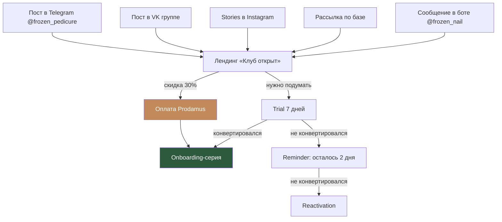

# Воронка 2: Тёплый трафик (существующая база)

## Цель
Конвертировать существующих учениц и подписчиц Кати (10 000+ человек) в подписчиц клуба. Это самый горячий трафик с наивысшей конверсией.

## Схема

## Пошаговое описание

### Шаг 1: Анонс в каналах

**Telegram @frozen_pedicure (5 400+ подписчиков):**
Серия из 5 постов за 2 недели до запуска:
1. **Тизер** (за 14 дней): «Работаю над кое-чем большим. Скоро расскажу...»
2. **Проблема** (за 10 дней): «Telegram замедляют, видео не грузится. Мне нужно было найти решение для вас — и я его нашла.»
3. **Решение** (за 7 дней): «Создала собственную платформу, где все курсы, вебинары и поддержка — в одном месте. По подписке. Подробности через неделю.»
4. **Подробности** (за 3 дня): «Вот что будет внутри Frozen Club...» + скриншоты платформы + описание тарифов
5. **Запуск** (День 0): «Frozen Club открыт! Для вас — скидка 30% на первый месяц. Только 7 дней.»

**VK (vk.com/frozen_pedicure):**
- Адаптация тех же 5 постов для VK
- Закреплённый пост с ссылкой на лендинг

**Instagram @frozen.nail:**
- 5 Stories с обратным отсчётом
- Reels с тизером платформы
- Ссылка в bio

**Бот @frozen_nail (существующий):**
- Push-уведомление всем пользователям бота
- Новая кнопка в /start: «Frozen Club — мой новый клуб»

### Шаг 2: Специальный лендинг для своих

URL: learn.baskova.pro/vip-launch (или UTM-метка)

Отличия от основного лендинга:
- Персональное обращение: «Привет! Ты уже часть моей команды — и я хочу, чтобы ты была среди первых в клубе»
- Скидка 30% на первый месяц (промокод FROZEN30)
- Ограничение: промокод действует 7 дней
- Блок «Ты уже знаешь мои курсы — теперь всё в одном месте»
- Отзывы от бета-тестеров (если есть)

### Шаг 3: Email-рассылка по базе

Если есть email-база учениц (из Prodamus, старых покупок):
- Email 1 (День запуска): «Frozen Club открыт — для тебя скидка 30%»
- Email 2 (День 3): «Что внутри клуба — подробный обзор»
- Email 3 (День 5): «Последние 2 дня со скидкой 30%»

### Шаг 4: Прямая оплата или Trial

**Вариант A: Прямая оплата со скидкой**
- Базовый: 1 393 ₽ вместо 1 990 ₽ (первый месяц)
- Профессионал: 2 793 ₽ вместо 3 990 ₽
- VIP: 5 593 ₽ вместо 7 990 ₽
- Со второго месяца — полная цена

**Вариант B: Trial 7 дней**
- Для тех, кто хочет посмотреть платформу перед оплатой
- Привязка карты через Prodamus
- Автоматическое списание на 8-й день

### Шаг 5: Onboarding
- Стандартная Onboarding-серия (5 писем за 10 дней)
- Дополнительно: персональное приветственное сообщение от Кати в чате

## Триггеры переходов

| Событие | Действие |
|---------|---------|
| Клик на ссылку из TG/VK/IG | Лендинг с UTM |
| Применил промокод FROZEN30 | Скидка 30% на первый месяц |
| Оплатил | Onboarding-серия + приветствие в чате |
| Начал trial | Trial-серия (напоминания) |
| Trial истекает через 2 дня | Push-уведомление + email |
| Не конвертировался после trial | Reactivation через 7 дней |

## Метрики

| Метрика | Цель |
|---------|------|
| Охват анонсов (TG+VK+IG) | 5 000+ |
| CTR на лендинг | 10-15% |
| Конверсия лендинг → оплата/trial | 15-25% |
| Trial → Paid | 40%+ (тёплая аудитория) |
| Итоговая конверсия | 5-10% от охвата |
| Ожидаемый результат за 7 дней | 50-100 подписчиц |

## Особенности воронки

1. **Без email-серии Welcome/Nurture** — аудитория уже знает Катю
2. **Короткий цикл** — от анонса до покупки 1-7 дней
3. **Скидка как триггер** — ограниченное время создаёт urgency
4. **Мультиканальность** — одновременно TG, VK, IG, бот, email
5. **Персонализация** — «ты уже мой ученик/подписчик» vs «привет, я Катя»
