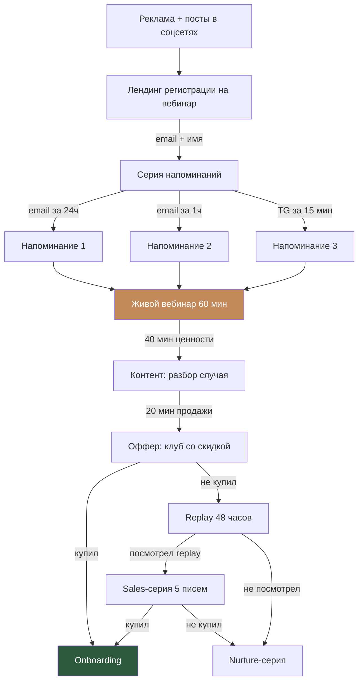

# Воронка 3: Вебинарная

## Цель
Провести бесплатный вебинар с ценным контентом (40 мин) + продажа клуба (20 мин). Работает для тёплого и холодного трафика одновременно.

## Схема

## Пошаговое описание

### Шаг 1: Регистрация на вебинар

**Лендинг вебинара:**
- Тема: «Как уверенно работать со сложными стопами: разбор 3 реальных случаев с Катей Басковой»
- Дата/время: указать конкретное
- Формат: бесплатно, онлайн, 60 минут
- Что узнаете: 3 конкретных takeaways
- Форма: имя + email (+ опционально Telegram для напоминаний)
- Кнопка: «Записаться бесплатно»

**Промо вебинара:**
- Telegram: 3 поста (за 7, 3, 1 день)
- VK: 3 поста + event
- Instagram: Stories + пост
- Реклама VK: на холодную аудиторию
- Email по базе (если есть)

### Шаг 2: Серия напоминаний

| Когда | Канал | Сообщение |
|-------|-------|-----------|
| Сразу после регистрации | Email | «Ты зарегистрирована! Сохрани дату: [дата, время]. Вот ссылка на вебинар: [ссылка]» |
| За 24 часа | Email | «Завтра в [время] — наш вебинар. Подготовь блокнот, будет много полезного!» |
| За 1 час | Email + TG | «Через час начинаем! Вот ссылка: [ссылка]» |
| За 15 минут | TG (если подписан) | «Стартуем через 15 минут! Заходи: [ссылка]» |

### Шаг 3: Вебинар (60 минут)

**Структура:**

**0-5 мин: Приветствие**
- «Привет! Я Катя Баскова, практикующий мастер педикюра с 8-летним опытом»
- «Сегодня разберём 3 реальных случая из моей практики — покажу, как работаю и на что обращаю внимание»
- «Пишите вопросы в чат — отвечу в конце»

**5-20 мин: Случай 1 — Стержневая мозоль между пальцами**
- Фото до → анализ → техника обработки → фото после
- Ключевой takeaway: «Как определить стержень и когда его не трогать»

**20-35 мин: Случай 2 — Вросший ноготь с воспалением**
- Диагностика → план работы → демонстрация (видео) → результат
- Ключевой takeaway: «3 признака, что нужна нить, а не просто обработка»

**35-45 мин: Случай 3 — Грибок или не грибок?**
- Фото + обсуждение → 5 визуальных признаков → что делать мастеру
- Ключевой takeaway: «Чек-лист: грибок или дистрофия — как отличить»

**45-50 мин: Q&A**
- Ответы на вопросы из чата (выбрать 5-7 самых частых)

**50-60 мин: Продажа**
- «Такие разборы мы делаем каждый месяц в Frozen Club»
- Что внутри: курсы, вебинары, чат, обратная связь
- Тарифы (кратко)
- Специальное предложение: скидка 40% на первый месяц для участников вебинара (промокод WEBINAR40, действует 48 часов)
- «Попробуй 7 дней бесплатно — если не твоё, ничего не заплатишь»
- Ссылка в чат + на экране

### Шаг 4: Replay (48 часов)

- Email сразу после вебинара: «Спасибо, что была! Вот запись (доступна 48 часов)»
- Email тем, кто не пришёл: «Жаль, что не смогла прийти! Вот запись — посмотри, пока доступна (48 часов)»
- В конце replay — баннер с оффером и промокодом

### Шаг 5: Sales-серия (для тех, кто смотрел, но не купил)

5 писем за 5 дней после вебинара:
1. «Что ты думаешь? Вот что говорят те, кто уже в клубе» (отзывы)
2. «Бонус для участниц вебинара: [дополнительный бонус]»
3. «Ответы на частые вопросы о клубе» (снятие возражений)
4. «Осталось 24 часа — промокод WEBINAR40 сгорает завтра»
5. «Промокод истёк. Но ты всё ещё можешь попробовать 7 дней бесплатно»

## Триггеры переходов

| Событие | Действие |
|---------|---------|
| Регистрация на вебинар | Серия напоминаний + тег «webinar_registered» |
| Посетила вебинар | Тег «webinar_attended» |
| Не пришла на вебинар | Email с replay |
| Посмотрела replay | Тег «replay_watched» → Sales-серия |
| Купила во время вебинара | Onboarding + тег «webinar_convert» |
| Не купила после Sales | Nurture-серия (общая) |

## Метрики

| Метрика | Цель |
|---------|------|
| Регистрации | 200-500 |
| Show-up rate (пришли) | 30-40% |
| Replay views | +20% от зарегистрированных |
| Конверсия live → покупка | 10-15% |
| Конверсия replay → покупка | 5-8% |
| Общая конверсия | 8-12% от регистраций |

## Частота проведения
- **Запуск:** 1 вебинар для старта клуба
- **Далее:** 1 раз в квартал для привлечения новых подписчиц
- **Evergreen-версия:** запись лучшего вебинара как автоворонка (через 3 месяца)
