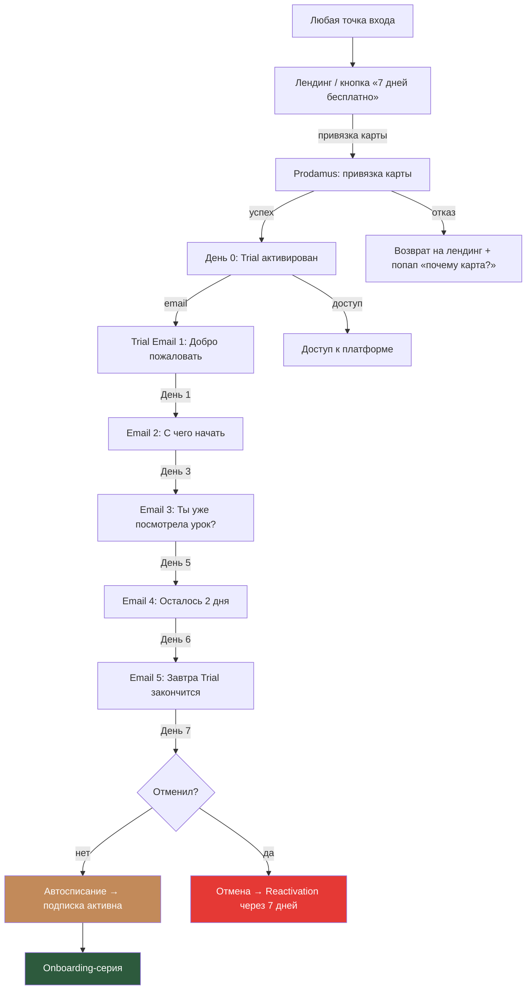

# Воронка 4: Пробный доступ (Trial)

## Цель
Дать потенциальной ученице 7 дней бесплатного доступа к клубу и конвертировать в платную подписку. Trial — это основной конвертирующий механизм для всех воронок.

## Схема

## Пошаговое описание

### Шаг 1: Активация Trial

**Условия:**
- Тариф: Базовый (1 990 ₽/мес)
- Длительность: 7 дней
- Требуется: email + привязка карты через Prodamus
- Если не отменить — автоматическое списание на 8-й день
- Каждый email может активировать trial только 1 раз

**Страница привязки карты:**
- «Для активации бесплатного периода нужна банковская карта. Списание произойдёт только через 7 дней. Отменить можно в любой момент в личном кабинете.»
- Кнопка: «Начать 7 дней бесплатно»
- Мелкий текст: «После пробного периода — 1 990 ₽/мес. Отмена в 1 клик.»

### Шаг 2: Trial Email-серия

**Email 1 (День 0): «Добро пожаловать в Frozen Club!»**
- Ссылка на платформу + данные для входа
- «Вот с чего я рекомендую начать:» — ссылка на первый бесплатный урок самого популярного курса
- «Загляни в чат — там уже 100+ мастеров, которые рады тебя видеть»
- P.S.: «У тебя 7 дней, чтобы посмотреть ВСЕ курсы. Пользуйся!»

**Email 2 (День 1): «С какого курса начать?»**
- Персонализация по данным (если есть):
  - Если пришла через квиз «Новичок» → рекомендация курса «Лаковое покрытие»
  - Если «Уверенный мастер» → «Титановая нить»
  - Если «Про» → «Мозоли и ВПЧ» (нужен Профессионал, апгрейд)
- Если данных нет → ТОП-3 самых популярных урока
- «Посмотри хотя бы 1 урок сегодня — увидишь, как устроено обучение»

**Email 3 (День 3): «Как идёт обучение?»**
- Если посмотрела уроки: «Ты уже посмотрела [N] уроков — отлично! Вот что рекомендую дальше: [ссылка]»
- Если не посмотрела: «Ещё не начала? Понимаю, дел много. Но у тебя осталось 4 дня — вот один урок на 10 минут, который можно посмотреть прямо сейчас: [ссылка]»
- Ссылка на чат: «Задай вопрос — мастера ответят»

**Email 4 (День 5): «Осталось 2 дня»**
- «Через 2 дня твой бесплатный доступ закончится»
- «Вот что ты пропустишь, если уйдёшь:» — 3 ценности клуба
- «Если тебе нравится — ничего делать не нужно. Подписка активируется автоматически (1 990 ₽/мес)»
- «Если не твоё — отмени в личном кабинете. Без вопросов.»

**Email 5 (День 6): «Завтра — последний день»**
- «Завтра заканчивается твой бесплатный период»
- Если активна: «Ты посмотрела [N] уроков. Не хочется терять прогресс!»
- Если неактивна: «Ты ещё не начала — посмотри хотя бы 1 урок перед тем, как решить: [ссылка на лучший урок]»
- Отзыв ученицы: «Я зашла попробовать — и осталась на полгода. Лучшее вложение в мою карьеру.»
- «Не хочешь продолжать? Отмени здесь: [ссылка]. Без обид.»

### Шаг 3: Автосписание (День 7)

**Если карта привязана и не отменено:**
- Списание 1 990 ₽
- Email: «Подписка активирована! Добро пожаловать в Frozen Club на постоянной основе.»
- Переход в Onboarding-серию

**Если списание не прошло (3 попытки):**
- Попытка 1: День 7
- Попытка 2: День 9
- Попытка 3: День 12
- Между попытками: email «Не удалось списать оплату. Обнови данные карты: [ссылка]»
- После 3 попыток: деактивация доступа + Reactivation-серия через 7 дней

**Если отменено до дня 7:**
- Доступ до конца 7-го дня
- Email: «Жаль, что уходишь. Если передумаешь — мы всегда здесь.»
- Через 7 дней: Reactivation-серия

## Триггеры переходов

| Событие | Действие |
|---------|---------|
| Trial активирован | Email 1 + полный доступ к платформе |
| Первый урок просмотрен | Тег «trial_engaged» |
| 3+ уроков за 3 дня | Тег «trial_active» (высокая вероятность конверсии) |
| 0 уроков за 3 дня | Email 3 с «мягким пушем» |
| Отмена trial | Email «жаль» + через 7 дней Reactivation |
| Успешное списание | Onboarding-серия |
| Неуспешное списание | Dunning emails (3 попытки) |

## Метрики

| Метрика | Цель |
|---------|------|
| Trial activation rate (от посетителей лендинга) | 15-20% |
| Trial engagement (посмотрел 1+ урок) | 60%+ |
| Trial → Paid conversion | 30-40% |
| Cancellation rate | < 50% |
| Failed payment recovery | 40% (из 3 попыток) |

## Оптимизация

1. **Персонализация email 2** — на основе источника трафика или результатов квиза
2. **In-app nudges** — уведомления внутри платформы: «Посмотри свой первый урок!»
3. **Progress gamification** — «Ты на 10% пути! Следующий урок: [название]»
4. **Exit intent** — если пользователь переходит на страницу отмены, показать попап: «Может, попробовать тариф Профессионал? Первый месяц -30%»
