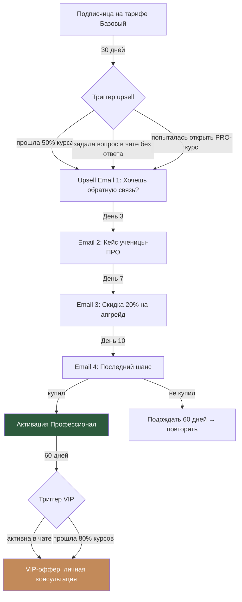

# Воронка 5: Upsell (апгрейд тарифа)

## Цель
Перевести подписчиц с тарифа Базовый на Профессионал или VIP. Увеличить ARPU (средний доход на пользователя) и LTV.

## Схема

## Пошаговое описание

### Upsell: Базовый → Профессионал

#### Триггеры запуска upsell-серии

| Триггер | Приоритет | Когда |
|---------|-----------|-------|
| Прошла 50%+ одного курса | Высокий | В любой момент после 14 дней |
| Попыталась открыть PRO-курс (Мозоли/Бизнес) | Высокий | Сразу |
| Задала вопрос в чате, на который Катя обычно отвечает приоритетно | Средний | После 30 дней |
| 30 дней на Базовом без отмены | Стандартный | День 30 |
| Посмотрела запись вебинара и не имеет доступа к live | Средний | После просмотра |

#### Upsell Email-серия (4 письма)

**Email 1: «Хочешь, чтобы Катя проверила твою работу?»**
- Тайминг: через 3 дня после триггера
- «Ты уже прошла [X]% курса [Название] — круто! Но я заметила, что самый быстрый рост начинается, когда есть обратная связь.»
- «На тарифе Профессионал я проверяю домашние задания, отвечаю на вопросы приоритетно и провожу живые вебинары каждый месяц.»
- Сравнение: что есть в Базовом vs что добавляется в Профессионал
- «Посмотри, что говорят ученицы на тарифе Про:» — 2 отзыва
- CTA: «Перейти на Профессионал»

**Email 2: «Как Марина подняла чек с 1 500 до 4 000 ₽ за 2 месяца»**
- Тайминг: через 3 дня после Email 1
- Развёрнутый кейс ученицы на тарифе Профессионал
- Что конкретно помогло: обратная связь на ДЗ + разбор на вебинаре + совет от Кати в чате
- «Разница между Базовым и Профессионал — это разница между "смотреть уроки" и "расти с поддержкой"»
- CTA: «Попробовать Профессионал»

**Email 3: «Специальное предложение: -20% на первый месяц Профессионал»**
- Тайминг: через 4 дня после Email 2
- «Я вижу, что ты активно учишься — и хочу помочь тебе расти быстрее.»
- Предложение: 3 192 ₽ вместо 3 990 ₽ за первый месяц (промокод UPGRADE20)
- Промокод действует 5 дней
- Что получаешь сверх Базового (конкретный список)
- CTA: «Апгрейд за 3 192 ₽»

**Email 4: «Последний день со скидкой»**
- Тайминг: через 4 дня после Email 3 (за 1 день до истечения промокода)
- Короткое письмо: «Промокод UPGRADE20 истекает завтра. Если хочешь обратную связь от меня и живые вебинары — сейчас лучший момент.»
- CTA: «Апгрейд сейчас»

#### Если не апгрейднулась
- Не повторять upsell-серию минимум 60 дней
- Через 60 дней — новый триггер (другой повод, другой оффер)
- Максимум 2 upsell-серии в квартал

---

### Upsell: Профессионал → VIP

#### Триггеры

| Триггер | Когда |
|---------|-------|
| 60+ дней на Профессионал | Автоматически |
| Прошла 80%+ курсов | В любой момент |
| Регулярно задаёт сложные вопросы в чате | Ручной триггер от модератора |
| Попросила личную консультацию | Сразу |

#### VIP-оффер (1-2 письма, без давления)

**Email 1: «Хочешь, чтобы я разобрала твой конкретный случай?»**
- «Ты уже прошла [N] курсов и задаёшь крутые вопросы. Мне кажется, тебе пора на следующий уровень.»
- Что даёт VIP: личная консультация 30 мин/мес + разбор твоих кейсов + ранний доступ + VIP-чат
- «В VIP-чате сейчас [N] человек — это самые мотивированные мастера клуба»
- «Попробуй 1 месяц — если не подойдёт, вернёшься на Профессионал»
- CTA: «Перейти на VIP»

**Email 2 (через 5 дней, если не апгрейднулась):**
- Отзыв VIP-ученицы: конкретный кейс, как личная консультация помогла решить проблему
- «Мест в VIP ограничено — сейчас [N] из 50 занято»
- CTA: «Узнать подробнее о VIP»

## Upsell внутри платформы

Помимо email, upsell-триггеры работают на платформе:

1. **Заблокированный контент:** при попытке открыть PRO-курс → попап «Этот курс доступен на тарифе Профессионал. Апгрейд за [цена]/мес»
2. **Баннер в dashboard:** после 30 дней на Базовом → «Хочешь больше? Перейди на Профессионал»
3. **После завершения курса:** «Поздравляем! Хочешь сертификат? Он доступен на тарифе Профессионал»
4. **В чате:** пометка «PRO» у ников учениц на Профессионал/VIP (социальное доказательство)

## Метрики

| Метрика | Цель |
|---------|------|
| Базовый → Профессионал (за 3 мес) | 15-20% |
| Профессионал → VIP (за 3 мес) | 5-10% |
| Upsell email open rate | 35%+ |
| Upsell email click rate | 8%+ |
| Промокод redemption rate | 20%+ |
| Увеличение ARPU | +30% за 6 месяцев |

## Правила upsell

1. **Не давить.** Если отказалась — ждать 60 дней минимум
2. **Только после ценности.** Upsell только после того, как ученица получила результат на текущем тарифе
3. **Конкретные причины.** Не «купи дороже», а «вот что конкретно ты получишь сверху»
4. **Лёгкий даунгрейд.** Если VIP/Про не подошёл — можно вернуться на Базовый без проблем
5. **Максимум 2 серии/квартал.** Не спамить upsell-предложениями
