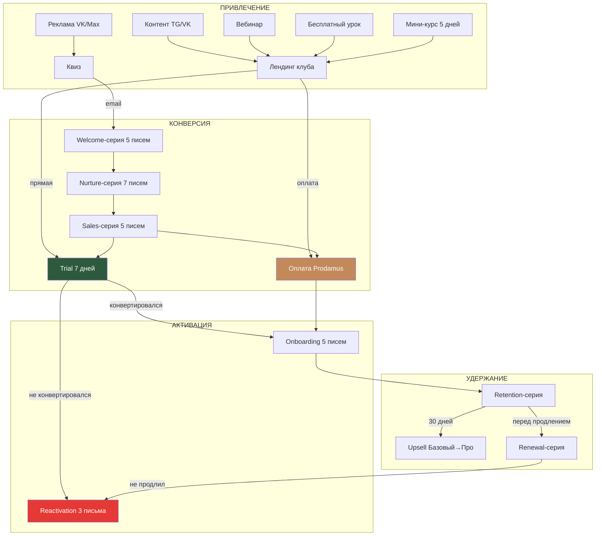
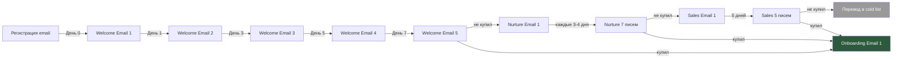

# Архитектура воронок Frozen Club

## Общая схема

## 5 воронок

| # | Воронка | Аудитория | Цель | Конверсия (цель) |
|---|---------|-----------|------|-----------------|
| 1 | Холодный трафик | Новые люди | Email → Trial | 3-5% в подписку |
| 2 | Тёплый трафик | 10 000+ учениц | Прямая подписка | 5-10% |
| 3 | Вебинарная | Регистранты вебинара | Подписка после вебинара | 10-15% |
| 4 | Пробный доступ | Все посетители лендинга | Trial → Paid | 30%+ |
| 5 | Upsell | Базовые подписчицы | Базовый → Профессионал | 15-20% |

## Триггеры переходов между воронками

## Метрики по воронкам

### Основные KPI

| Этап | Метрика | Цель |
|------|---------|------|
| Привлечение | CPL (Cost Per Lead) | < 150 ₽ |
| Привлечение | CTR рекламы | > 1.5% |
| Конверсия | Email open rate | > 35% |
| Конверсия | Email click rate | > 5% |
| Конверсия | Landing → Trial | > 15% |
| Конверсия | Trial → Paid | > 30% |
| Активация | Onboarding completion | > 60% |
| Удержание | Monthly churn | < 8% |
| Upsell | Basic → Pro upgrade | > 15% |

### Точки отслеживания

1. **Вход в воронку:** источник трафика (VK ads, organic TG, webinar, referral)
2. **Регистрация email:** форма на лендинге или квизе
3. **Welcome-серия:** open rate, click rate каждого письма
4. **Trial start:** дата начала, источник
5. **Trial активность:** сколько уроков посмотрел за 7 дней
6. **Оплата:** тариф, способ оплаты, рассрочка
7. **Onboarding:** % завершения серии, первый урок, первое сообщение в чате
8. **Retention:** активность в неделю/месяц, прогресс по курсам
9. **Churn:** дата отмены, причина (если указана)
